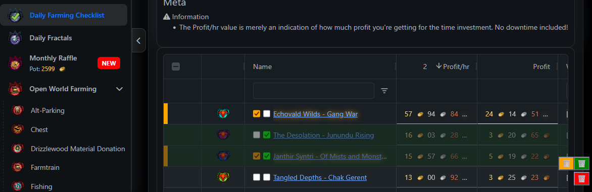

# Fast Farming Checkbox Everywhere
Fast.farming-community.eu checkbox everywhere userscript

https://greasyfork.org/en/scripts/559259-fast-farming-checkbox-everywhere

This userscript adds **persistent checkboxes** to all **Grid tables “Name” columns** on the Fast-Farming website, allowing you to mark items as completed directly in the table.

Checked items are **saved automatically** using browser storage and restored on page reload. Each checklist is stored **per page**, so the same name on different pages does not conflict.

## ✨ Features

* Adds a checkbox to every row in Grid tables (`Name` column)
* Persistent state (checkboxes remain checked after reload)
* Page-specific storage (same item name can be checked independently on different pages)
* Visual feedback for checked rows (reduced opacity + green highlight)

### 🗑 Reset Options

* **Yellow trash button**: double-click to reset checkboxes **only on the current page**
* **Red trash button**: double-click to reset **all checkboxes on the entire site**
* Both actions require confirmation to avoid accidental data loss

## ⚙ Technical Notes

* Designed specifically for `fast.farming-community.eu`
* No external dependencies